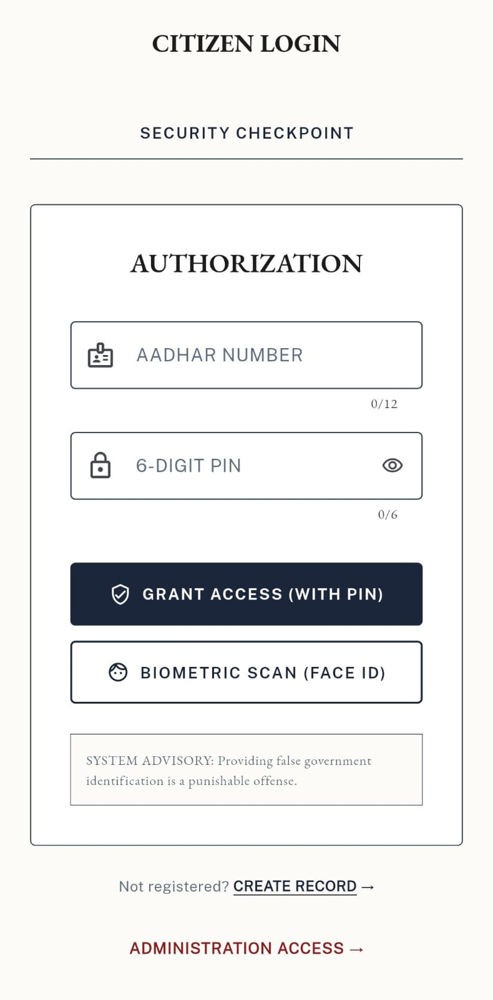
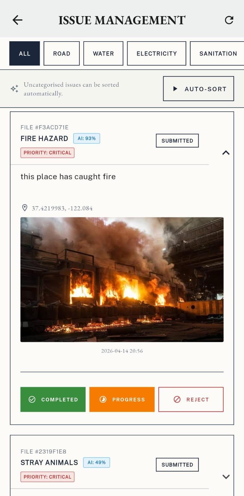
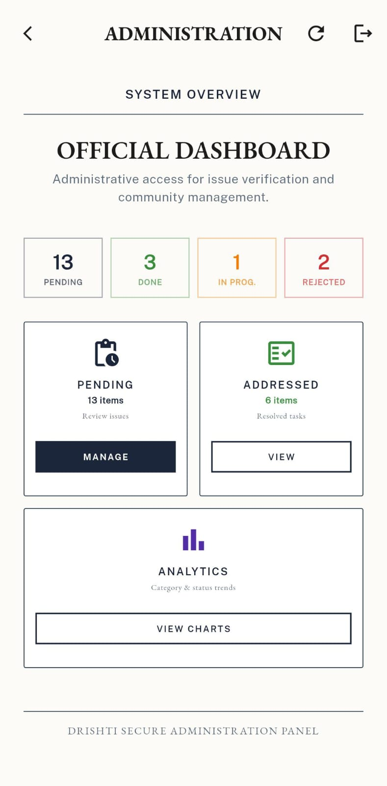

# DRISHTI - Civic Issue Reporting & Management Platform

> **DRISHTI** (दृष्टि) means *vision* in Sanskrit.

> It stands for *Digital Reporting Intelligent Sorting & Holistic Tracking of Issues*. A smart governance tool that lets citizens report civic problems and lets administrators manage, auto-categorise, and resolve them - powered by AI.

---

## Table of Contents

- [Overview](#overview)
- [Features](#features)
- [Architecture](#architecture)
- [Tech Stack](#tech-stack)
- [Project Structure](#project-structure)
- [Getting Started](#getting-started)
  - [Prerequisites](#prerequisites)
  - [Flutter App Setup](#flutter-app-setup)
  - [Backend Setup](#backend-setup)
- [Environment Variables](#environment-variables)
- [API Reference](#api-reference)
- [Screenshots](#screenshots)
- [Team](#team)

---

## Overview

DRISHTI is a full-stack Flutter application built for the FixForward Hackathon. It bridges the gap between citizens and municipal departments by:

- Letting citizens **report** civic issues (potholes, water leaks, broken streetlights, garbage dumps, etc.) with a photo and GPS location.
- Using a **CLIP AI model** to automatically categorise images into the correct department.
- Giving administrators a **real-time dashboard** to view, sort, and resolve complaints.
- Securing citizen identity with **Aadhar-based authentication**, a 6-digit PIN, and **face biometrics with liveness detection**.

---

## Demo & Resources

Explore the working prototype of **DRISHTI – Digital Reporting Intelligent Sorting & Holistic Tracking of Issues**.

Google Drive (APK + Demo Videos):  
https://drive.google.com/drive/folders/1o5LJeULRgarKfWe1B-3vb4DIGFSleG_4

### Contents
- Android APK – Install and test the app on a real device or emulator
- Documentation
- Demo videos – Complete walkthrough of:
  - Citizen flow (reporting and tracking issues)
  - Admin dashboard (management and analytics)  
- Screenshots – Key UI views of the application  

> Note: The APK is a demo/testing build intended for evaluation purposes only.

---

## Features

### Citizen
| Feature | Description |
|---|---|
| Aadhar Login | Sign in with 12-digit Aadhar number + 6-digit PIN |
| Face ID Login | Biometric login using live face scan (anti-spoof protected) |
| Report Issue | Capture photo + GPS location + optional description |
| AI Categorisation | Automatic department routing via CLIP image model |
| Track Issues | Real-time status updates (Pending → In Progress → Completed) |
| My Community | View issues reported in your area |
| Draft Support | Save unfinished reports as drafts |

### Administrator
| Feature | Description |
|---|---|
| Secure Admin Login | Separate admin credentials |
| Issue Dashboard | Live feed of all citizen complaints via Supabase Realtime |
| Auto-Sort | AI-powered bulk categorisation of uncategorised issues |
| Analytics | Issue trends, category breakdown, resolution rates |
| Resolved Issues | Archive of closed complaints |

---

## Architecture

```
  DATA COLLECTION              PROCESSING & ANALYSIS         CLOUD SERVICES
  ───────────────              ─────────────────────         ──────────────
  Flutter UI                   HF Space #1                   Supabase
  ├─ Camera input     ──────►  FastAPI + CLIP model  ──────► ├─ PostgreSQL (issues)
  ├─ GPS location              ├─ Image classification       ├─ profiles table
  └─ Text description          ├─ Text fallback              ├─ Realtime subscriptions
                               └─ Priority detection         └─ Storage (photos)

  AUTHENTICATION               FACE RECOGNITION              INTEGRATION
  ──────────────               ────────────────              ───────────
  Supabase profiles            HF Space #2                   Google Maps API
  ├─ Aadhar + PIN    ──────►  Flask + face_recognition       └─ Location display
  └─ PIN verify                ├─ Roboflow liveness check
                               ├─ 128-dim face encoding
                               └─ Firebase Firestore
                                  (embedding storage -
                                   backend-internal only)

  ADMIN DASHBOARD
  ───────────────
  Flutter (in-app)
  ├─ Supabase Realtime feed
  ├─ Auto-sort → HF Space #1 /categorize
  └─ Analytics + resolve actions
```

---

## Tech Stack

### Flutter App
| Layer | Technology |
|---|---|
| Mobile Framework | Flutter (Dart) - cross-platform Android & iOS |
| Authentication | Supabase (`profiles` table - Aadhar + 6-digit PIN) |
| Database | Supabase PostgreSQL |
| Realtime Updates | Supabase Realtime subscriptions |
| File / Image Storage | Supabase Storage (issue photos) |
| Maps & Location | Google Maps Flutter + Geolocator |
| Local Persistence | `path_provider` (draft issues) |

### AI Backends (Hugging Face Spaces - Docker)

| Service | Technology | HF Space |
|---|---|---|
| Categorisation API | Python FastAPI + OpenAI CLIP (`clip-vit-base-patch32`) | [`shubpaste404/drishti`](https://huggingface.co/spaces/shubpaste404/drishti) |
| Face Auth API | Python Flask + `face_recognition` (dlib) | [`pasteshub404/navikarana-backend`](https://huggingface.co/spaces/pasteshub404/navikarana-backend) |
| Liveness Detection | Roboflow `face-anti-spoofing` (called by Face Auth API) | Serverless via Roboflow |
| Face Embedding Storage | Firebase Firestore *(used internally by Face Auth API only - Flutter app does not use Firebase)* | - |

---

## Project Structure

```
DRISHTI/
├── lib/
│   ├── main.dart
│   │
│   ├── models/
│   │   ├── issue.dart
│   │   └── navigation_widget.dart
│   │
│   ├── pages/
│   │   ├── aadhar_login.dart
│   │   ├── user_register_page.dart
│   │   ├── home_page.dart
│   │   ├── report_issue_page.dart
│   │   ├── track_issue.dart
│   │   ├── my_community.dart
│   │   ├── resolved_issues_page.dart
│   │   ├── settings_page.dart
│   │   ├── admin_login_page.dart
│   │   ├── admin_dashboard_page.dart
│   │   ├── admin_issue_view_page.dart
│   │   └── admin_analytics_page.dart
│   │
│   ├── services/
│   │   ├── api_service.dart
│   │   ├── draft_service.dart
│   │   ├── export_service.dart
│   │   ├── realtime_service.dart
│   │   └── sync_service.dart
│   │
│   ├── theme/
│   │   └── app_theme.dart
│   │
│   └── widgets/
│       └── record_card.dart
│
├── android/app/src/main/
│   └── AndroidManifest.xml
│
├── ios/Runner/
│   └── Info.plist
│
└── pubspec.yaml
```

> **Face Recognition backend** (HF Space #2) is maintained separately at [`pasteshub404/navikarana-backend`](https://huggingface.co/spaces/pasteshub404/navikarana-backend)

---

## Getting Started

### Prerequisites

- Flutter SDK `>=3.8.1`
- Dart SDK `>=3.0`
- A Supabase project with `profiles` and `issues` tables
- Google Maps API key
- Two Hugging Face Spaces running (see [Backend Setup](#backend-setup))

### Flutter App Setup

```bash
# 1. Clone the repo
git clone https://github.com/your-username/DRISHTI.git
cd DRISHTI

# 2. Install dependencies
flutter pub get

# 3. Add your API keys (see Environment Variables section)

# 4. Run
flutter run
```

### Backend Setup

**Categorisation Backend (HF Space #1)**

The `backend/` folder contains the FastAPI + CLIP server deployed as a Docker Hugging Face Space.

```bash
# Local test
cd backend
pip install -r requirements.txt
uvicorn server:app --host 0.0.0.0 --port 7860
```

Push to a Hugging Face Space - the `Dockerfile` handles everything automatically.

**Face Recognition Backend (HF Space #2)**

See [`pasteshub404/navikarana-backend`](https://huggingface.co/spaces/pasteshub404/navikarana-backend).  
Set the following as **HF Space Secrets**:

| Secret | Description |
|---|---|
| `FIREBASE_SERVICE_ACCOUNT_JSON` | Full Firebase Admin SDK service account JSON |
| `ROBOFLOW_API_KEY` | Roboflow API key for liveness detection |

---

## Environment Variables

### Flutter (`lib/main.dart`)

| Variable | Location | Description |
|---|---|---|
| Supabase URL | `main.dart` | Your Supabase project URL |
| Supabase Anon Key | `main.dart` | Supabase publishable/anon key |
| Google Maps Key | `AndroidManifest.xml` | `com.google.android.geo.API_KEY` |

---

## API Reference

### Categorisation Backend - `https://shubpaste404-drishti.hf.space`

#### `POST /complaint`
Submit a citizen complaint with an image.

| Field | Type | Description |
|---|---|---|
| `file` | multipart file | Issue photo (max 5 MB) |
| `lat` | float (form) | GPS latitude |
| `lon` | float (form) | GPS longitude |
| `text_input` | string (form, optional) | Text description (fallback for low-confidence images) |

**Response**
```json
{
  "category": "ROAD",
  "confidence": 87.3,
  "priority": "High"
}
```

#### `POST /categorize`
Admin auto-sort endpoint. Categorises from a stored image URL + text description.

**Request body (JSON)**
```json
{
  "text_input": "large pothole near the market",
  "image_url": "https://...",
  "lat": 0.0,
  "lon": 0.0
}
```

**Response**
```json
{
  "category": "ROAD",
  "confidence": 91.2,
  "priority": "Medium",
  "status": "success"
}
```

---

### Face Recognition Backend - `https://pasteshub404-navikarana-backend.hf.space`

#### `POST /register-face`
Register a citizen's face embedding during signup. Runs liveness check first.

| Field | Type | Description |
|---|---|---|
| `image` | multipart file | Front-facing photo |
| `username` | string (form) | Aadhar number |

**Response:** `{"status": "registered"}` or `{"error": "reason"}`

#### `POST /login-face`
Verify a citizen's identity during login. Runs liveness check + 128-dim face comparison.

| Field | Type | Description |
|---|---|---|
| `image` | multipart file | Live face photo |
| `username` | string (form) | Aadhar number |

**Response:** `{"verified": true}` or `{"verified": false, "error": "reason"}`

---

## Screenshots

> *(Add screenshots to `docs/screenshots/` and update paths below)*

| Citizen Login | Report Issue | Admin Dashboard |
|---|---|---|
|  |  |  |
---

## Team

Built for **FixForward Hackathon** by **Team Aperture**.

| Name | Role |
|---|---|
| Shubham Paste | Full Stack - Flutter + AI Backends |

---

## License

This project is for academic / hackathon use. All rights reserved © Team Aperture.
